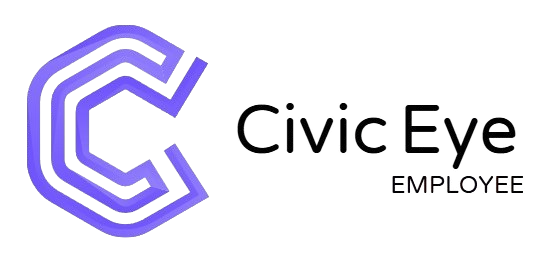
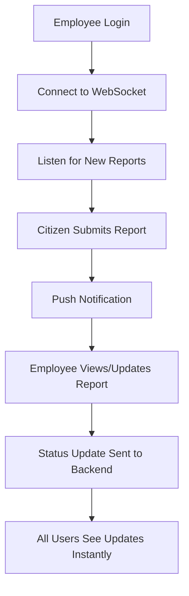

<p align="center">
  
</p>

# CivicEye Employee App

**تطبيق مراقبة  مشكلات  البنية التحتية**

<p align="center">
  
</p>

---

## 📝 Project Overview | نظرة عامة على المشروع

**English:**
CivicEye Employee App is a Flutter-based mobile application designed for government or municipal employees to manage, track, and update citizen reports (issues, complaints, incidents) in real-time. The app provides seamless notification, report assignment, status updates, and direct communication through WebSocket technology.

**العربية:**
تطبيق عين المواطن للموظفين هو تطبيق موبايل مبني باستخدام Flutter، يهدف إلى تمكين موظفي الجهات الحكومية أو البلدية من إدارة وتتبع ومعالجة بلاغات المواطنين (مشاكل، شكاوى، حوادث) بشكل لحظي، مع دعم كامل للإشعارات وتحديثات الحالة والتواصل الفوري عبر WebSocket.

---

## 📦 Project Structure | هيكلية المشروع

```plaintext
lib/
  ├── core/         # الخدمات والبنية التحتية (API, WebSocket, التخزين، إلخ)
  ├── cubits/       # إدارة الحالة باستخدام Bloc/Cubit لكل جزء (تسجيل دخول، تقارير، إلخ)
  ├── models/       # نماذج البيانات (الموظف، البلاغ، إلخ)
  ├── screens/      # الشاشات الرئيسية (تسجيل دخول، الرئيسية، تفاصيل البلاغ، الإشعارات)
  ├── widgets/      # عناصر واجهة مستخدم مخصصة (AppBar, Drawer, Cards, إلخ)
  ├── animations/   # مؤثرات حركية للشاشات
  └── main.dart     # نقطة تشغيل التطبيق
```

---

## 🖥️ Main Features | الميزات الرئيسية

- **User Authentication | تسجيل الدخول:**
  - Secure employee login and session management.
  - تسجيل دخول الموظف وإدارة الجلسات بشكل آمن.

- **Report Management | إدارة البلاغات:**
  - View, filter, and update citizen reports in real-time.
  - عرض، تصفية، وتحديث البلاغات بشكل لحظي.

- **Notifications | الإشعارات:**
  - Instant push notifications for new reports and status updates.
  - إشعارات فورية عند وصول بلاغ جديد أو تحديث حالة.

- **WebSocket Integration | تكامل WebSocket:**
  - Real-time communication for instant report delivery and updates.
  - استقبال البلاغات والتحديثات بشكل لحظي عبر WebSocket.

- **Profile & Settings | الملف الشخصي والإعدادات:**
  - Manage employee profile and preferences.
  - إدارة بيانات الموظف وتفضيلاته.

---

## 🧑‍💻 Main Screens | الشاشات الرئيسية

- **Sign In | شاشة تسجيل الدخول**
- **Home | الشاشة الرئيسية**
- **Report Details | تفاصيل البلاغ**
- **Assigned Reports | البلاغات الموكلة**
- **Notifications | الإشعارات**
- **Profile | الملف الشخصي**

---

## 🔄 Data Flow & State Management | تدفق البيانات وإدارة الحالة

- Uses Bloc/Cubit for state management (e.g., ReportsCubit, AuthCubit, ThemeCubit).
- يتم الاعتماد على Bloc/Cubit لإدارة الحالة وتدفق البيانات بين الشاشات والخدمات.
- WebSocket for real-time updates, push notifications for alerts.
- WebSocket لتحديثات البلاغات اللحظية، والإشعارات للتنبيهات.

---

## 🛠️ Core Services & Models | الخدمات والنماذج الأساسية

- **WebSocket Service:** Real-time report delivery and status updates.
- **Notification Helper:** Local push notifications and deep linking to reports.
- **ReportModel, EmployeeModel:** Data models for reports and employees.
- **Cache/Storage:** Local storage for tokens, employee info, etc.

---

## 🚀 Getting Started | بدء الاستخدام

**English:**
1. Install Flutter SDK and dependencies.
2. Clone the repository.
3. Run `flutter pub get` to fetch packages.
4. Launch the app using `flutter run`.

**العربية:**
1. تثبيت Flutter وجميع المتطلبات.
2. استنساخ المستودع.
3. تنفيذ الأمر `flutter pub get` لجلب الحزم.
4. تشغيل التطبيق باستخدام `flutter run`.

---

## 📑 File/Folder Descriptions | وصف مختصر للملفات والمجلدات

- `lib/core/`: Core services (API, WebSocket, Storage, Themes, etc.)
- `lib/cubits/`: State management units (authentication, reports, etc.)
- `lib/models/`: Data models (Report, Employee, etc.)
- `lib/screens/`: Main UI screens for the app.
- `lib/widgets/`: Custom reusable widgets.
- `main.dart`: App entry point, providers, and routing setup.

---

## 🌐 Technology Stack | التقنيات المستخدمة

- **Flutter** (Dart)
- **Bloc/Cubit** for state management
- **WebSocket** (stomp_dart_client)
- **Local Notifications** (flutter_local_notifications)
- **Provider, Shared Preferences, Secure Storage**

---

## 🏷️ Notes | ملاحظات

- The app is RTL (Right-to-Left) ready for Arabic users.
- التطبيق يدعم الاتجاه من اليمين لليسار (RTL) بالكامل.
- All sensitive operations are secured and use local storage.
- جميع العمليات الحساسة مؤمنة ويتم حفظ البيانات محليًا.

---

## 🔁 Workflow Example | مثال تدفق العمل

<p align="center">


</p>

**English:**
1. Employee logs in to the app.
2. The app connects to the WebSocket server and listens for new reports.
3. When a citizen submits a report, it appears instantly in the employee's home screen and triggers a push notification.
4. The employee can view the report, update its status (e.g., In Progress, Resolved), and add notes.
5. All updates are sent in real-time to the backend and reflected for all relevant users.

**العربية:**
1. يسجل الموظف الدخول إلى التطبيق.
2. يتصل التطبيق بخادم WebSocket ويبدأ في الاستماع للبلاغات الجديدة.
3. عند إرسال مواطن لبلاغ، يظهر فورًا على شاشة الموظف مع إشعار فوري.
4. يمكن للموظف عرض البلاغ وتحديث حالته (قيد التنفيذ، تم الحل، إلخ) وإضافة ملاحظات.
5. جميع التحديثات تُرسل لحظيًا للسيرفر وتظهر فورًا لجميع الأطراف المعنية.

---

## ⚡ Real-Time Reports Flow | تدفق البلاغات اللحظي

**English:**
- The app uses `StompWebSocketService` to connect to a WebSocket server.
- When a new report is received (from `/topic/employee/{id}`), it is added to the ReportsCubit and a notification is shown.
- Employees can update the status of reports, which are sent back via WebSocket.

**العربية:**
- يستخدم التطبيق خدمة WebSocket (StompWebSocketService) للاتصال اللحظي.
- عند استقبال بلاغ جديد من السيرفر (من `/topic/employee/{id}`)، يُضاف مباشرة إلى ReportsCubit ويظهر إشعار للموظف.
- يمكن للموظف تحديث حالة البلاغ، وترسل التحديثات للسيرفر عبر WebSocket.

---

## 👨‍💻 Code Examples | أمثلة كود

**English Example: Receiving New Report via WebSocket**
```dart
// main.dart (WebSocket message listener)
_wsSubscription = _webSocketService.reportStream.listen((msg) {
  final decoded = jsonDecode(msg);
  if (decoded is Map<String, dynamic>) {
    final report = ReportModel.fromJson(decoded);
    BlocProvider.of<ReportsCubit>(context, listen: false).addReport(report);
    NotificationHelper.showNotification('New Report', report.title);
  }
});
```

**عربي: استقبال بلاغ جديد عبر WebSocket**
```dart
// main.dart (مستمع رسائل WebSocket)
_wsSubscription = _webSocketService.reportStream.listen((msg) {
  final decoded = jsonDecode(msg);
  if (decoded is Map<String, dynamic>) {
    final report = ReportModel.fromJson(decoded);
    BlocProvider.of<ReportsCubit>(context, listen: false).addReport(report);
    NotificationHelper.showNotification('بلاغ جديد', report.title);
  }
});
```

**English Example: Update Report Status**
```dart
// Update report status via WebSocket
_webSocketService.sendUpdateStatus(
  reportId: report.reportId,
  newStatus: 'Resolved',
  notes: 'Issue fixed',
  employeeId: employee.id,
);
```

**عربي: تحديث حالة بلاغ**
```dart
// تحديث حالة البلاغ عبر WebSocket
_webSocketService.sendUpdateStatus(
  reportId: report.reportId,
  newStatus: 'تم الحل',
  notes: 'تم إصلاح المشكلة',
  employeeId: employee.id,
);
```

---

## ❓ FAQ | الأسئلة الشائعة

**Q: Why am I not receiving notifications?**
- Make sure notification permissions are granted and the app is not killed in the background.

**س: لماذا لا تصلني الإشعارات؟**
- تأكد من إعطاء الصلاحيات اللازمة للإشعارات وعدم إغلاق التطبيق بالكامل من الخلفية.

**Q: How do I reset my password?**
- Contact your system administrator.

**س: كيف أعيد تعيين كلمة المرور؟**
- تواصل مع مسؤول النظام.

**Q: The app is not connecting to WebSocket, what should I do?**
- Check your internet connection and try restarting the app.

**س: التطبيق لا يتصل بـ WebSocket، ماذا أفعل؟**
- تحقق من اتصال الإنترنت وحاول إعادة تشغيل التطبيق.

---

## 📞 Contact & Contribution | التواصل والمساهمة

**English:**
For suggestions or contributions, please open an issue or contact the maintainer.

**العربية:**
للاقتراحات أو المساهمة، يرجى فتح Issue أو التواصل مع المطور المسؤول.

---

